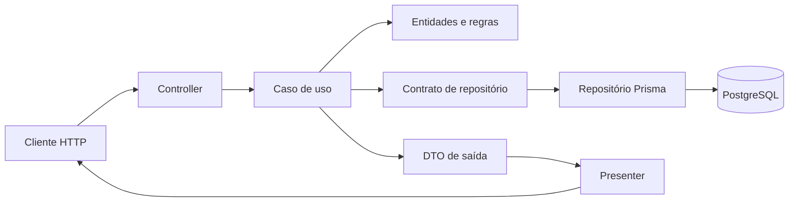

# Arquitetura

## Princípio central

O núcleo da aplicação não conhece NestJS nem Prisma. Domínio e casos de uso
definem o comportamento; a infraestrutura adapta requisições HTTP e operações
do PostgreSQL para esses contratos.



A direção importante é `infrastructure → application → domain`. O domínio não
deve importar camadas externas.

## Organização por recurso

Os recursos `users`, `barberShop`, `services` e `appointments` repetem a mesma
estrutura:

```text
src/<recurso>/
├── domain/
│   ├── entities/       # estado e invariantes
│   ├── value-objects/  # valores com semântica própria
│   ├── validators/     # validação de entidades
│   └── repositories/   # contratos de persistência
├── application/
│   ├── usecases/       # orquestração das regras
│   ├── dto(s)/         # modelos de saída
│   ├── services/       # políticas reutilizadas por casos de uso
│   └── ports/          # contratos externos, como transações
└── infrastructure/
    ├── dto/            # entrada e validação HTTP
    ├── presenters/     # serialização da resposta
    ├── database/prisma # repositórios, mappers e transações
    ├── *.controller.ts
    └── *.module.ts
```

`src/shared` concentra os elementos transversais: entidade base, paginação,
erros, hash de senha, Prisma, configuração, filtros, presenters compartilhados
e o interceptor de resposta.

## Responsabilidade de cada camada

### Domínio

- representa entidades e value objects;
- garante invariantes no construtor e nos métodos de alteração;
- declara contratos de repositório;
- lança erros de domínio, sem conhecer códigos HTTP;
- gera os UUIDs por meio da entidade base.

### Aplicação

- executa uma intenção do usuário em um caso de uso;
- verifica existência, propriedade, papel e transições permitidas;
- combina múltiplos repositórios e serviços de domínio/aplicação;
- retorna DTOs de saída, nunca modelos Prisma;
- delimita operações atômicas por ports quando necessário.

Os casos de uso seguem o padrão de namespace:

```ts
export namespace NomeUseCase {
  export type Input = {};
  export type Output = {};

  export class UseCase implements UseCaseContract<Input, Output> {
    async execute(input: Input): Promise<Output> {
      // regra e orquestração
    }
  }
}
```

### Infraestrutura

- controller: converte HTTP em uma chamada de caso de uso;
- DTO: valida e transforma body ou query string;
- presenter: controla o formato público da resposta;
- repository: implementa o contrato do domínio com Prisma;
- mapper: converte modelo persistido em entidade e vice-versa;
- module: monta a injeção de dependências.

Repositórios são injetados por tokens de string, como
`'AppointmentRepository'`. Casos de uso são registrados usando a própria classe
`UseCase` como token.

## Caminho de uma requisição

Uma criação de agendamento ilustra o fluxo:

1. o `ValidationPipe` transforma `date` e rejeita campos inválidos;
2. o `AuthGuard` valida o JWT e coloca `id` e `role` em `request.user`;
3. o controller acrescenta o usuário autenticado como `clientId`;
4. o caso de uso carrega serviço e barbearia;
5. o serviço de disponibilidade verifica expediente, folgas e conflitos;
6. a entidade valida o novo agendamento;
7. o repositório Prisma persiste a entidade;
8. o DTO de saída e o presenter selecionam os campos públicos;
9. o interceptor envolve o resultado em `{ data: ... }`.

## Autenticação e autorização

Há duas barreiras complementares:

- `AuthGuard`: valida `Authorization: Bearer <accessToken>`;
- `RoleGuard`: compara o papel do token com `@Roles(...)`.

O guard de papel protege a entrada, mas não substitui as regras do caso de uso.
Propriedade e vínculo continuam sendo conferidos na aplicação, pois dois
usuários com o mesmo papel não possuem acesso aos mesmos recursos.

## Persistência

`PrismaService` é o acesso ao PostgreSQL. `prisma/schema.prisma` descreve o
modelo atual e cada alteração é registrada em uma nova migration.

A criação de uma barbearia é um exemplo de atomicidade: inserir a barbearia,
promover o usuário para `owner` e associá-lo ao estabelecimento acontece em uma
única transação Prisma. Assim, uma falha não deixa o cadastro pela metade.

Para impedir double booking concorrente, além da verificação na aplicação, uma
migration adiciona proteção no PostgreSQL contra intervalos sobrepostos do
mesmo barbeiro.

## Componentes globais

- prefixo HTTP: `/api/v1`;
- servidor: NestJS sobre Fastify;
- validação: `class-validator`, com transformação e rejeição de campos extras;
- serialização: `ClassSerializerInterceptor` e presenters;
- envelope: `WrapperDataInterceptor`;
- documentação: Swagger/OpenAPI gerado a partir de controllers e DTOs;
- CORS: origens configuradas por ambiente;
- erros: filtros globais para os erros já padronizados.
