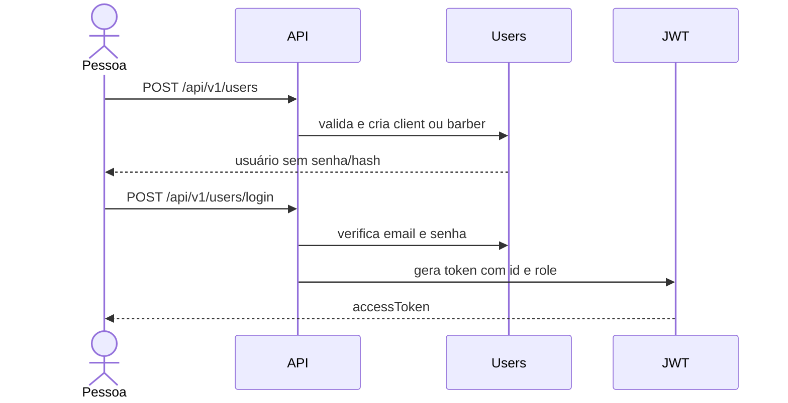
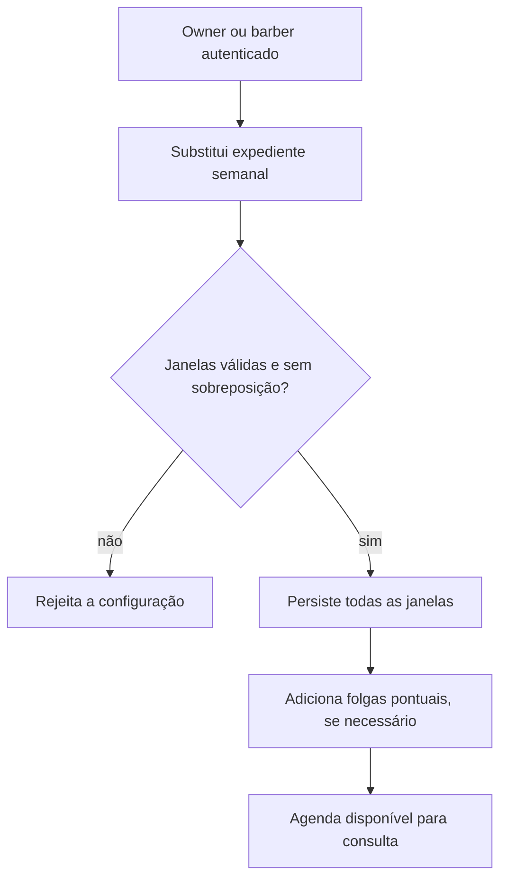
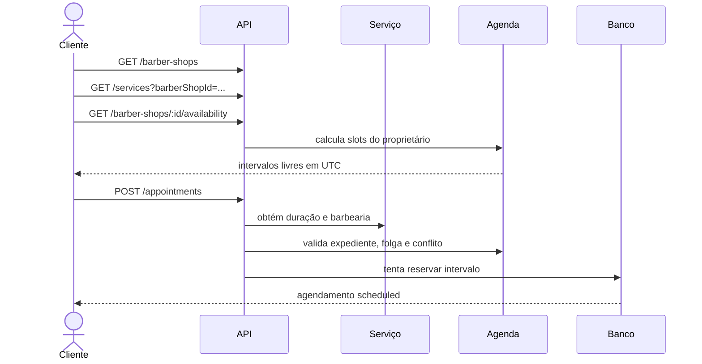
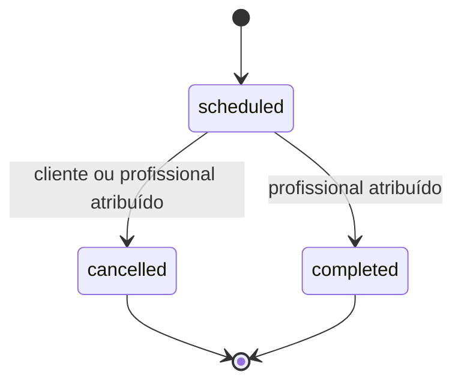

# Fluxos da aplicação

Este documento descreve as jornadas como sequências de decisões. Para payloads
e schemas exatos, use o Swagger.

## 1. Cadastro e autenticação



O cadastro aceita apenas `client` ou `barber`. `owner` não é um papel
selecionável: ele é resultado da criação de uma barbearia.

O papel é gravado dentro do JWT no momento do login. Depois que um barbeiro cria
sua barbearia e passa a `owner`, ele deve autenticar novamente para receber um
token com o novo papel e acessar as rotas protegidas de proprietário.

## 2. Onboarding do proprietário

1. criar uma conta com papel `barber`;
2. autenticar e enviar o Bearer token;
3. criar a barbearia em `POST /api/v1/barber-shops`;
4. a API cria o estabelecimento, promove o usuário e grava
   `User.barberShopId` na mesma transação;
5. autenticar novamente para atualizar o papel do JWT;
6. criar um ou mais serviços;
7. configurar o expediente semanal;
8. opcionalmente registrar folgas.

A operação falha se a conta não for `barber` ou se já existir uma barbearia
para o usuário.

## 3. Publicação da agenda



O expediente é uma recorrência semanal. Cada janela contém dia da semana,
minuto inicial e minuto final no fuso da barbearia. A atualização substitui
todas as janelas anteriores; enviar uma lista vazia fecha a agenda.

Folgas são intervalos absolutos e pontuais. Elas complementam o expediente sem
alterar a recorrência.

## 4. Descoberta e criação de agendamento

O cliente percorre estes identificadores:

```text
barberShop.id → service.id → slot.startsAt → appointment.id
```

Fluxo:

1. listar barbearias públicas;
2. guardar o `id` da barbearia escolhida;
3. listar serviços usando `barberShopId`;
4. guardar o `id` e observar a duração do serviço;
5. consultar a disponibilidade usando data local e `serviceId`;
6. escolher o `startsAt` retornado pela API;
7. autenticar e criar o agendamento com `serviceId` e `date`;
8. guardar `appointment.id` para consultas e alterações posteriores.



Na implementação atual, a API escolhe automaticamente o proprietário como
`barberId`. O cliente ainda não escolhe um profissional.

## 5. Como um horário é validado

Um intervalo só é aceito quando todas as condições são verdadeiras:

1. o serviço existe e pertence à barbearia;
2. `endDate` é calculado como `date + service.duration`;
3. início e fim cabem inteiramente em uma janela do expediente;
4. o intervalo não atravessa o dia local, exceto se terminar exatamente à
   meia-noite;
5. não há interseção com uma folga;
6. não há interseção com outro agendamento `scheduled` do barbeiro;
7. o banco consegue persistir sem violar a proteção contra reservas
   concorrentes.

A consulta pública gera candidatos a cada 30 minutos. A duração do serviço não
precisa ser múltipla de 30; o intervalo final sempre usa a duração real.

## 6. Ciclo de vida do agendamento



- apenas agendamentos `scheduled` podem ser alterados;
- cliente pode cancelar, mas não concluir nem remarcar;
- o profissional atribuído pode cancelar, concluir e remarcar;
- ao trocar serviço, o novo serviço deve pertencer à mesma barbearia;
- um agendamento cancelado deixa de bloquear o horário;
- não existe exclusão física de agendamento pela API.

## 7. Consulta de agendamentos

A listagem muda conforme o usuário autenticado:

- se ele é encontrado como proprietário de uma barbearia, recebe os
  agendamentos daquela barbearia;
- caso contrário, recebe os agendamentos em que é cliente.

A busca individual também permite acesso ao cliente, ao proprietário da
barbearia e ao barbeiro atribuído. Quando o agendamento existe, mas não é
visível para o usuário, a API responde como não encontrado para não revelar
dados de terceiros.

Profissionais adicionais ainda não possuem uma listagem de agenda específica;
essa limitação está registrada no [backlog](./backlog/todos.md).
