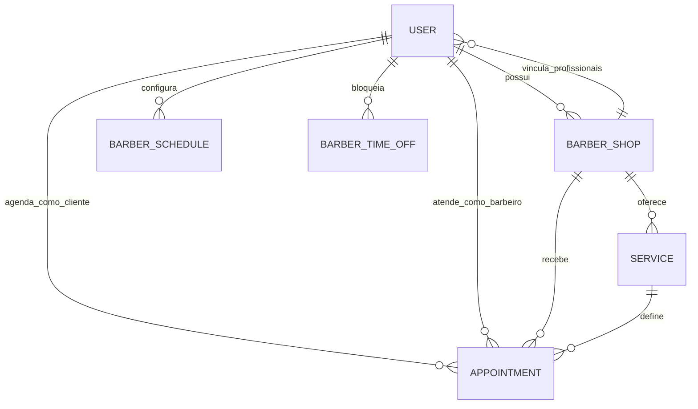

# Visão geral

## O que é a aplicação

A Barber Shop API é o backend de uma plataforma de barbearias. Ela permite
cadastrar contas, publicar barbearias e serviços, configurar o expediente dos
profissionais e controlar agendamentos.

A implementação usa NestJS com Fastify, TypeScript, Prisma e PostgreSQL. As
regras de negócio são isoladas dos detalhes de HTTP e banco de dados por uma
organização inspirada em Clean Architecture e DDD.

## Recursos principais

| Recurso         | Responsabilidade                                                                  |
| --------------- | --------------------------------------------------------------------------------- |
| Usuário         | Identidade, credenciais e papel da conta.                                         |
| Barbearia       | Estabelecimento, endereço, fuso horário e proprietário.                           |
| Serviço         | Oferta da barbearia, com preço, descrição e duração.                              |
| Disponibilidade | Expediente semanal e folgas pontuais de um profissional.                          |
| Agendamento     | Reserva de um serviço, ligando cliente, profissional e barbearia em um intervalo. |

## Atores

### Cliente (`client`)

Explora a vitrine pública, consulta serviços e horários, cria agendamentos com
uma conta autenticada, acompanha os próprios agendamentos e pode cancelá-los.

### Barbeiro (`barber`)

Pode criar uma barbearia e, nesse momento, passa a ser `owner`. O modelo também
permite que um barbeiro seja vinculado a uma barbearia, configure sua agenda e
atenda reservas atribuídas a ele. A API ainda não possui endpoints para
adicionar ou remover esses profissionais.

### Proprietário (`owner`)

Administra sua barbearia e os serviços dela. Também configura o próprio
expediente e atua como profissional padrão nos agendamentos públicos. Hoje, a
API limita a gestão a uma barbearia por proprietário.

## Relações essenciais

- `BarberShop.ownerId` identifica o proprietário.
- `User.barberShopId` identifica a barbearia em que o profissional atua.
- `Service.barberShopId` impede que um serviço seja usado fora de sua
  barbearia.
- `Appointment` guarda `clientId`, `barberId`, `barberShopId` e `serviceId`.
- Todos os IDs públicos são UUIDs.

## Estado atual do produto

O fluxo completo já atende a barbearia operada pelo próprio dono:

1. um usuário se cadastra como `barber`;
2. cria uma barbearia e é promovido a `owner`;
3. cadastra serviços e configura seu expediente;
4. um cliente encontra a barbearia, escolhe serviço e horário;
5. o agendamento é atribuído ao proprietário;
6. cliente e profissional acompanham o ciclo da reserva.

O schema suporta profissionais adicionais, mas o onboarding deles e a escolha
do barbeiro durante o agendamento ainda não estão expostos. Consulte o
[backlog](./backlog/todos.md) para as demais limitações conhecidas.

## Mapa da documentação

- Entenda a implementação em [Arquitetura](./arquitetura.md).
- Veja as jornadas ponta a ponta em [Fluxos da aplicação](./fluxos.md).
- Consulte permissões e invariantes em
  [Regras de negócio](./regras-de-negocio.md).
- Integre um cliente HTTP usando o [Guia da API](./api.md) e o Swagger.
- Prepare o ambiente pelo guia de [Desenvolvimento](./desenvolvimento.md).
